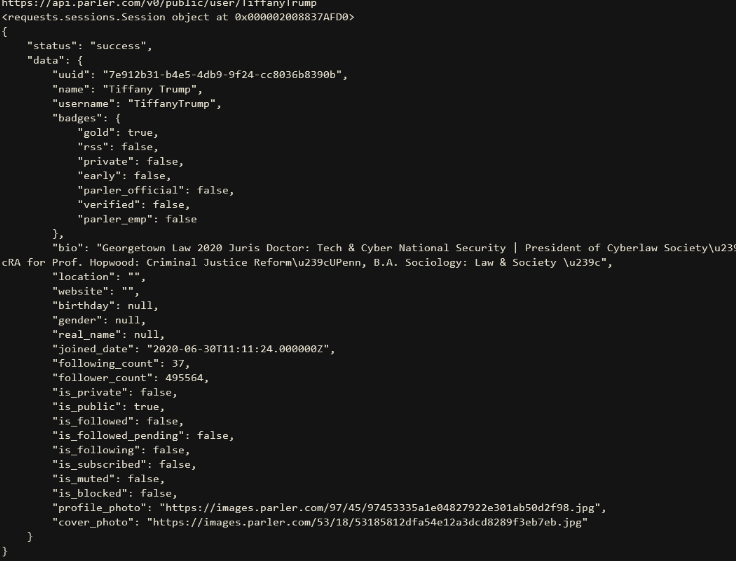
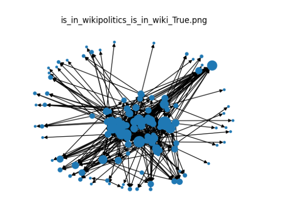

# Scrapping data from parler, wikipedia  and analyzing the  created graph

The main goal of the project was to analyse parler service, because its not as popular as the Twitter.
Data for 4  groups was scrapped and then added to graphs and analyzed.
Those groups are:
    - celebrities,
    - journalists_writers, 
    - politics_engaged,
    - politics.

The problem with parler is that the information about which people follow someone isn't avaible freely. Therefore 
when it came to scrapping it was done  recursively by choosing a list of people and then with certain deep its possible to access who this person follows
and by that graph can be created.
List of people was created manually for different groups.

## Not that many informations can be scrapped from parler

The sensible ones were:
    - name,
    - username,
    - follower_count
    - following_count.

Also to confirm information that someone exist (bot accounts are everywhere) data from wikipedia was scrapped and used to identify the person.

One of the scrapped graphs and analyzed with networkx is shown below:

Used things:
    networkx - to create, analyse and plot graphs,
    parler api,
    beautifulsoup4,
    pyCurl.

The main program programs are:
    - analyse.py to analyse the graphs,
    - crawler.py to scrap data from parler,
    - wiki_scraper was used to scrap data from wiki,
    - graph analiser uses networkx.

The program was created with colleagues.

How to run:
pip install -r /path/to/requirements.txt
and then undocumment the code of analyse and crawler and just run it.

